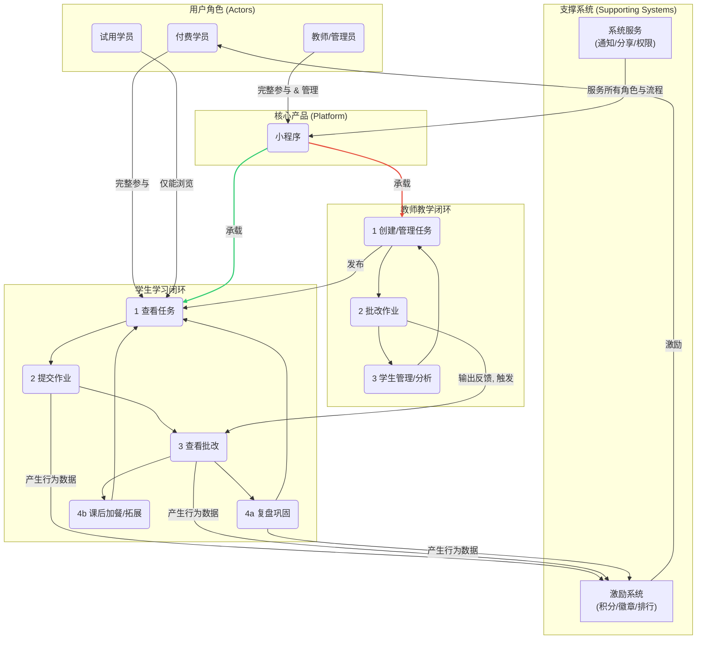
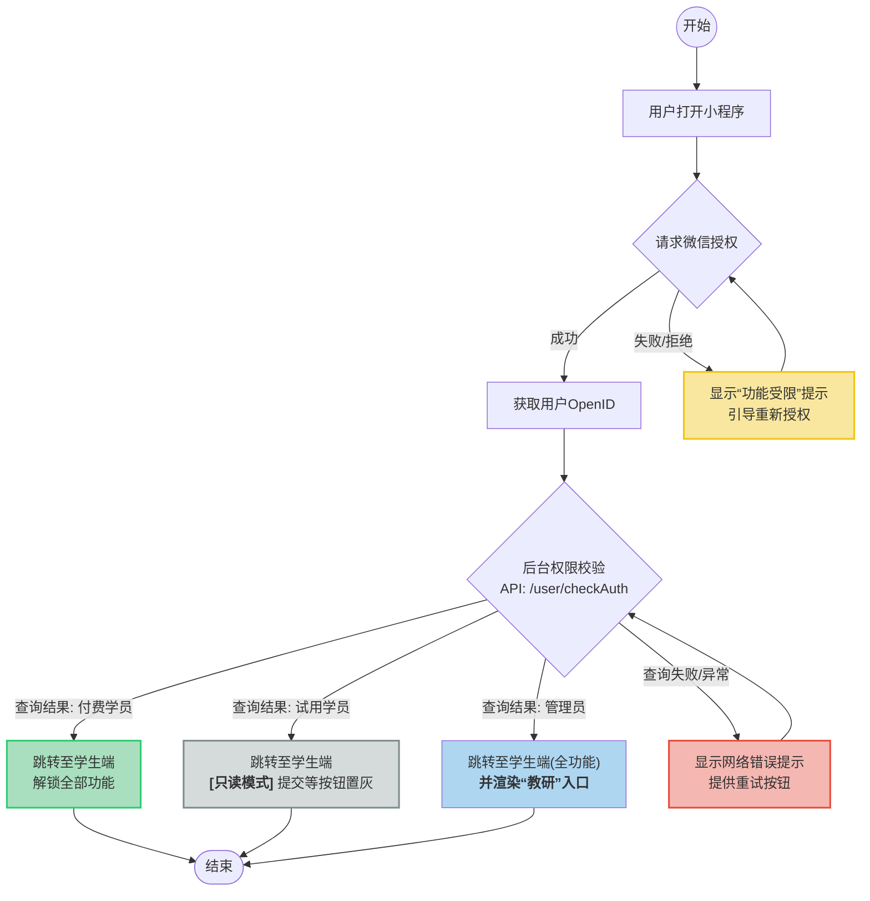
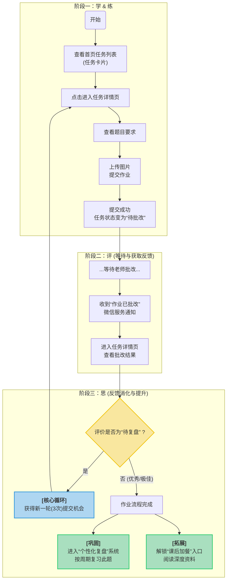
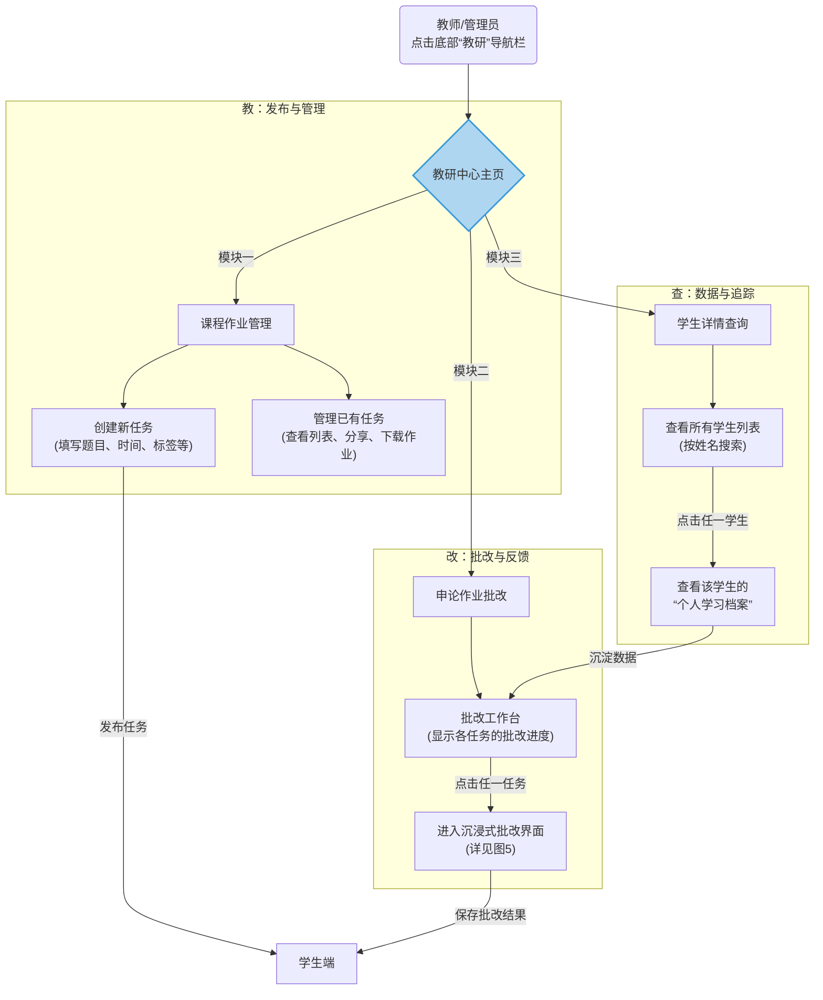
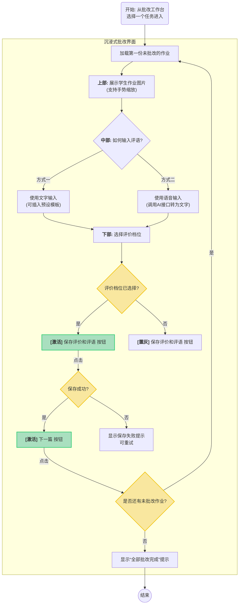
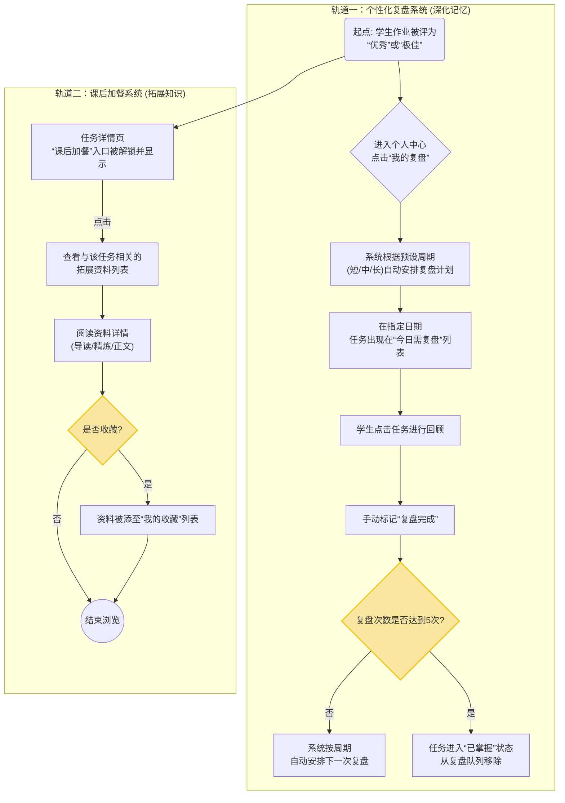
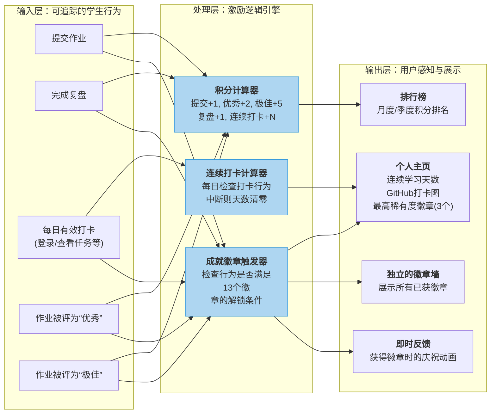
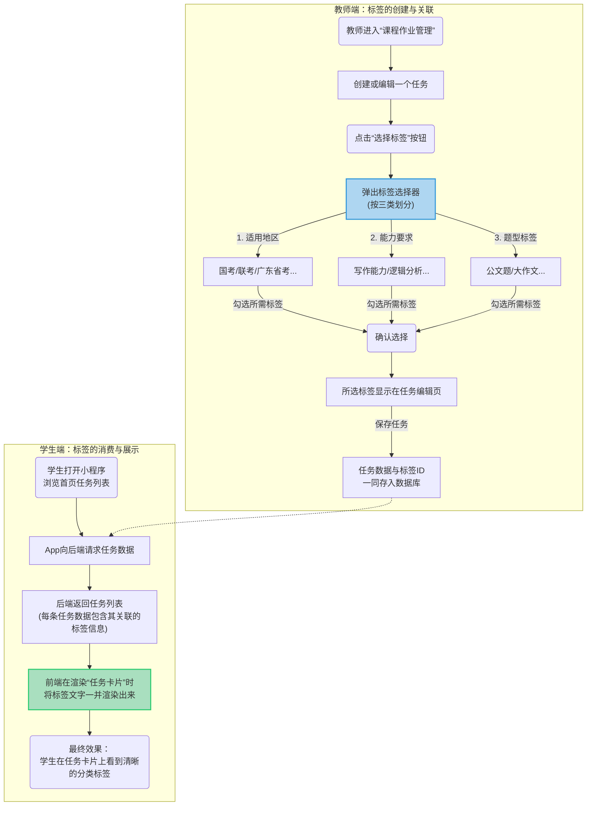
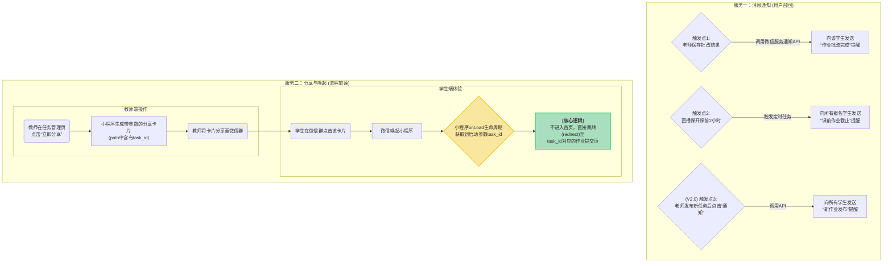

好的，收到您的全部要求。完全明白您的目标：需要一个**完整、可渲染、包含深度设计思路注解**的Mermaid图表集合，用于图形化查看和理解整个产品的功能逻辑。

根据您的确认，我将开始工作。我会将复杂的系统拆分为多个独立的、但逻辑上互相关联的Mermaid图表，确保每一张图都结构清晰、语法正确，并附上必要的设计思路解读。

这会是一个系列图集，我会逐一为您生成，从顶层的系统架构开始，逐步深入到各个核心模块的流程细节。

现在，我将为您生成第一部分：**系统顶层架构与用户旅程图**。

---

### **图1：公考督学助手 - 系统顶层架构与核心交互图**

**【功能设计思路】**

这张图是整个系统的最高层视图，旨在回答一个核心问题：“这个产品由哪几大利益方构成？他们之间最核心的交互是什么？”

我们定义了三个核心角色：**付费学员**、**试用学员**和**教师/管理员**。整个系统围绕着两大核心闭环运转：

1. **学生学习闭环**：学生通过小程序获取任务，完成并提交，获得老师的反馈，最后通过复盘和拓展学习将知识内化。这是一个完整的输入、处理、输出、再输入的循环。
    
2. **教师教学闭环**：教师创建和管理任务，批改学生提交的作业，并通过数据分析来了解学情。教师的输出（任务、批改）是学生闭环的输入。
    

两大闭环通过**小程序**这个核心载体紧密耦合，并通过底层的**激励与支撑系统**获得体验增强。试用学员被设计为这个生态的“观察者”，能看到内容，但无法参与核心循环，以此引导其转化。

### **图2：用户身份与权限管理流程图**

**【功能设计思路】**

这张图详细描述了用户从进入小程序到获得最终身份的全过程，是整个系统安全和个性化体验的基石。

设计的核心在于一个**集中的权限校验节点**。无论用户是谁，都必须经过`权限校验`这一关。这一步会查询后端数据库，根据用户的OpenID返回其角色：`付费学员`、`试用学员`或`管理员`。

- **路径分化**：校验结果直接决定了用户的后续路径。付费学员和试用学员都进入学生端，但看到的界面和可执行的操作有云泥之别。这是通过**前端UI层的条件渲染**和**后端API层的二次验证**双重保险实现的。
    
- **管理员的特殊性**：管理员身份是“叠加态”，他既能以学员视角体验完整功能，又拥有一个专属的“教研”入口，可以无缝切换身份，方便其管理和测试。
    
- **鲁棒性设计**：流程图考虑了授权失败或查询失败的异常情况，确保在任何时候都有明确的提示和重试机制，避免用户卡在未知状态。

### **图3：学生核心学习闭环 (学-练-评-思) 流程图**

**【功能设计思路】**

这张图是整个产品的“发动机舱”，它详细描绘了付费学员一次完整的“学习-练习-反馈-提升”的作业流程，这也是产品为用户创造核心价值的地方。

设计的关键节点是**“查看批改结果”后的逻辑分叉**：

1. **“待复盘”逻辑 (`is_needs_review == true`)**：这是我们设计的**内部提升循环**。当老师认为作业质量有待提高时，系统会自动“再给一次机会”，刷新学生的提交次数。这不仅是一个评价，更是一个**驱动学生主动修改、进行二次思考的机制**。这个设计避免了传统作业“一锤子买卖”的弊端，让反馈真正落地。
    
2. **正常完成逻辑**：当作业质量达标后，流程并不会简单结束。系统会引导学生进入**知识内化**的阶段，这是学习的升华。
    
    - **复盘系统**：解决“学过就忘”的问题，通过艾宾浩斯遗忘曲线，将短期记忆转化为长期能力。
        
    - **课后加餐**：解决“学得不深”的问题，提供与任务相关的拓展阅读，满足学有余力的学生的需求。
        

整个流程的设计目标是：**不仅要完成作业，更要通过高质量的反馈和科学的复习机制，让学生真正学到东西**。

### **图4：教师核心教学闭环 (教-管-改-查) 总览图**

**【功能设计思路】**

这张图描绘了教师/管理员在小程序“教研”模块中的核心工作流。我们的设计理念是**“集成化”与“角色分离”**。

- **集成化**：将教师需要的所有高频操作——`创建任务(教)`、`监控进度(管)`、`批改作业(改)`、`查询学生(查)`——全部集成在一个“教研”入口下。教师无需离开小程序即可完成从备课到教学评估的全套工作，形成高效的管理闭环。
    
- **角色分离**：尽管教师和学生使用同一个小程序，但通过严格的权限校验，我们将教学管理功能与学习功能彻底分离。普通学生看不到“教研”入口，确保了教学后台的安全性和专业性。
    

此图展示了三大模块的入口和它们之间的逻辑关系。`课程作业管理`是起点，负责生产内容；`申论作业批改`是核心，负责价值交付（反馈）；`学生详情查询`是结果沉淀，用于数据追踪和分析。

### **图5：教师作业批改 (沉浸式界面) 详细流程图**

**【功能设计思路】**

批改作业是教师最高频、最耗时的工作。因此，这个界面的核心设计目标是**“效率”**和**“专注”**，我们希望为老师创造一个心流（Flow）体验。

1. **效率提升**：
    
    - **混合输入**：针对不同场景，提供了`文字模板`和`语音转文字`两种输入方式。打字用于标准化评语，语音用于个性化长评语，极大提升输入效率。
        
    - **智能导航**：通过进度条和学生信息卡片，老师对全局进度和当前对象一目了然。手势滑动和快捷键（未来规划）将进一步减少点击操作。
        
2. **专注体验 (防错机制)**：
    
    - **状态锁**：`[保存]`按钮的设计是关键。只有当老师对评价档位做出选择后，`[保存]`按钮才会被激活。
        
    - **流程锁**：`[下一篇]`按钮的设计是另一个关键。只有当老师点击了`[保存]`并成功后，`[下一篇]`按钮才会被激活。
        
    - 这两个“锁”的设计，**强制规定了“评价 -> 保存 -> 下一篇”的线性流程**，从机制上彻底杜绝了“忘记保存就划到下一份”或“未做评价就跳过”的人为失误，保证了批改工作的严肃性和准确性。
        
3. **数据驱动**：新增的`数据统计`和`历史`入口，让老师在批改过程中可以随时跳出，从宏观视角分析教学效果，实现微观操作与宏观分析的结合。
    

### **图6：知识内化双轨制 - 复盘与加餐系统流程图**

**【功能设计思路】**

单纯完成作业并看到评价，不代表真正掌握。为了对抗遗忘、拓宽视野，我们设计了`复盘`和`加餐`两个并行的系统。

- **个性化复盘系统（纵向深化）**：
    
    - **目的**：解决“学过就忘”的痛点。
        
    - **机制**：基于“艾宾浩斯遗忘曲线”理论。当一个知识点被成功掌握（作业获优良评价）后，系统会自动将其纳入一个智能的复习队列。学生可以根据自己的基础选择不同的复习频率（短/中/长周期），系统会像私人教练一样，在最容易遗忘的时间点提醒学生回来巩固。**其核心是“重复”与“记忆”**。
        
- **课后加餐系统（横向拓展）**：
    
    - **目的**：满足学有余力的学生“学得更深、更广”的需求。
        
    - **机制**：当学生高质量完成一个任务后，系统会解锁与该任务知识点相关的深度阅读材料。这是一种即时奖励，也是一种学习路径的延伸。学生可以将有价值的资料收藏起来，逐步建立自己的个人知识库。**其核心是“拓展”与“理解”**。
        

这个“双轨制”设计，让学生在完成核心任务后，可以自主选择是“向下扎根”（复盘）还是“向上生长”（加餐），满足了不同层次的学习需求。

Code snippet

---

接下来，我们将探讨如何通过游戏化机制来持续激励用户，这也是提升产品粘性和用户活跃度的关键。

### **图7：学习激励系统 - 数据、徽章与排行逻辑图**

**【功能设计思路】**

这张图描绘了产品的“游戏化层”。其核心设计思想是**“正向反馈循环”**：学生的每一个积极的学习行为都应被系统捕捉，并转化为可见的、可量化的、可炫耀的成就，从而激励他们产生更多的积极行为。

我们将激励系统拆解为三个层次，分别对应不同时间维度的激励：

1. **即时反馈（数据与积分）**：
    
    - 学生完成一次提交、一次复盘，积分就会变化。这种即时的、可量化的反馈能带来最直接的满足感。`连续学习天数`和`GitHub打卡图`则将“坚持”这种抽象的行为变得具体可见。
        
2. **中期目标（成就徽章）**：
    
    - 徽章为用户设立了清晰、可达成的一系列中期目标（如“连续学习7天”、“获得5个优秀”）。获得徽章时的“庆祝动画”和稀有度设计，提供了比积分更强的仪式感和荣誉感，是驱动用户持续活跃的关键。
        
3. **长期驱动（排行榜）**：
    
    - 排行榜引入了“社交竞争”元素，满足了用户的社交和尊重需求。通过月度和季度排行，为长期的、持续的投入提供了最终的展示舞台。
        

这套系统将枯燥的学习过程，包装成了一场“打怪升级”的游戏，让用户在获得知识的同时，也能收获乐趣与成就。

Code snippet

好的，我们继续完成剩余模块的逻辑梳理。

现在，我们来关注一些虽然不是核心流程、但对内容组织和用户体验至关重要的支撑功能。首先是“任务标签体系”。

---

### **图8：任务分类标签体系 - 创建与展示逻辑图**

**【功能设计思路】**

这个功能的设计目标是**“信息降噪”与“快速识别”**。公考题目繁多，学生在浏览任务列表时，如果仅靠标题，很难快速找到符合自己薄弱项的题目。

- **对于教师（创建端）**：我们提供了一个结构化的、封闭的标签系统（分为`地区`、`能力`、`题型`三大类）。这避免了教师随意创建标签导致的管理混乱，确保了内容组织的一致性和规范性。教师在创建任务时，只需点选，即可完成对题目的“特征标定”。
    
- **对于学生（展示端）**：标签以最直观的方式展示在“任务卡片”上。学生无需点进详情，扫一眼标签（如“国考”、“应用文写作”）就能立刻明白这道题的考察重点，从而可以更有针对性地进行选择和练习，大大提升了学习效率。
    

这个系统本质上是在内容生产者和消费者之间，建立了一套统一的、高效的“沟通语言”。

Code snippet

---

最后，我们将梳理两个关键的系统级服务：**消息通知**和**分享唤起**。它们是连接产品与微信生态、提升用户活跃和流程效率的“神经系统”。

### **图9：系统核心服务 - 通知与分享流程图**

**【功能设计思路】**

这张图描绘了两个独立但都至关重要的系统级功能，它们的设计目标分别是**“用户召回”**和**“流程加速”**。

1. **消息通知（用户召回）**:
    
    - 在小程序“用完即走”的理念下，我们需要一个合规、有效的手段在关键时刻提醒用户“回来看看”。
        
    - 我们选择了两个最高价值的时刻进行触达：**`作业批改完成时`**（学习闭环的关键节点，用户获得反馈的欲望最强）和**`课前作业截止时`**（利用deadline驱动用户完成任务）。
        
    - 这些通知的设计是非打扰性的，只在用户最需要的时候出现，以提升打开率和用户好感度。
        
2. **分享与唤起 (Deep Linking - 流程加速)**:
    
    - 该功能旨在解决教师在微信群里发布作业后，学生操作路径过长的问题。
        
    - 传统路径：`群里看到通知 -> 打开小程序 -> 找到首页 -> 在列表里找到对应任务 -> 点进去提交`。
        
    - **Deep Linking优化后**：`群里点击分享卡片 -> 直接打开该任务的提交页`。
        
    - 通过在分享卡片的启动路径中嵌入任务ID (`task_id`)，小程序在被唤醒时能立刻识别并执行**“一步到位”的页面跳转**。这极大地优化了师生间的互动体验，是产品流畅性的核心体现。
        

Code snippet

